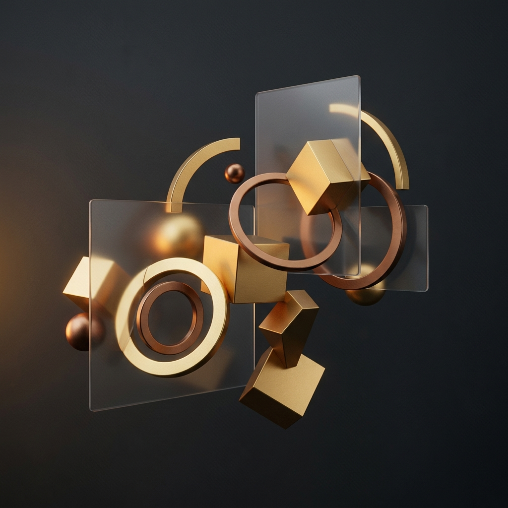
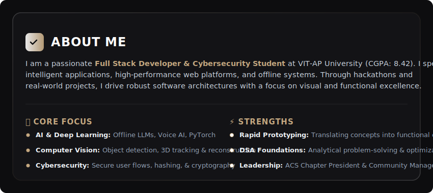
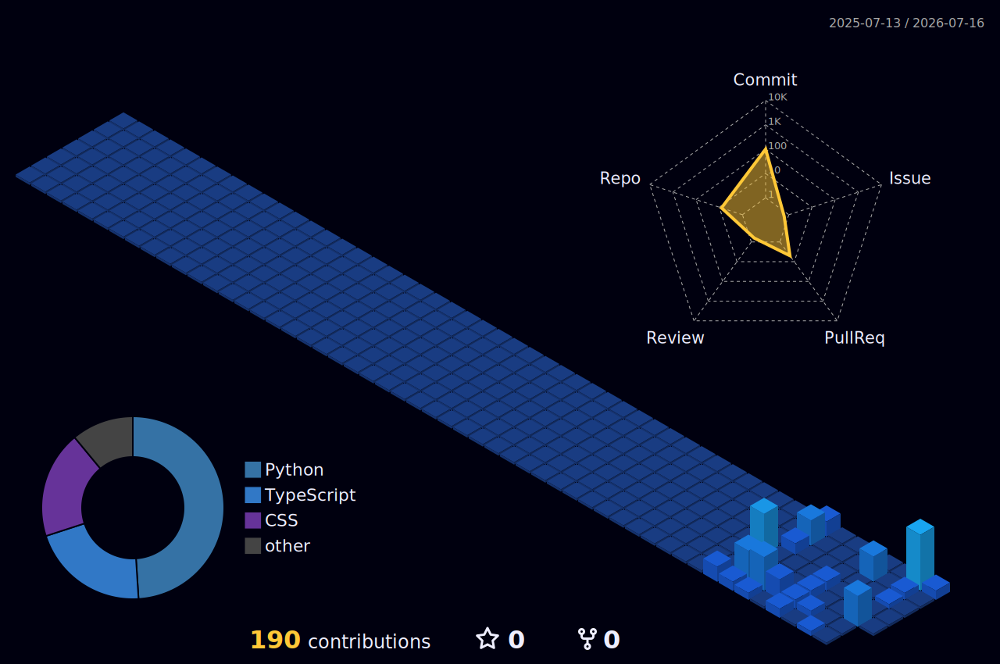

  

# 👋 Hi, I'm Boddeti Bhaskar!
### AI Engineer • Full Stack Developer • Cybersecurity Student @ VIT-AP

  

  
  
  

---

## 🚀 About Me

  

---

## 💼 Professional Experience & Leadership

<table border="0" width="100%">
  <tr>
    <td width="50%" valign="top">
      <h3>🛠️ Experience</h3>
      <ul>
        <li>
          <strong>Technical Lead</strong> @ <em>Upfront Startup</em> 
          <small>2026 - Present</small>
          <ul>
            <li>Leading development of scalable web apps and AI-powered solutions.</li>
            <li>Collaborating on product architecture, UI/UX, and rapid prototyping.</li>
          </ul>
        </li>
        <li>
          <strong>Full Stack Developer Intern</strong> @ <em>Prayana Electric</em> 
          <small>Dec 2025 - Apr 2026</small>
          <ul>
            <li>Developing modern full-stack web applications and responsive interfaces.</li>
            <li>Working on smart mobility and IoT-integrated web platforms.</li>
          </ul>
        </li>
      </ul>
    </td>
    <td width="50%" valign="top">
      <h3>👥 Leadership & Community</h3>
      <ul>
        <li>
          <strong>President</strong> @ <em>ACS Chapter, VIT-AP</em> 
          <small>May 2026 - Present</small>
          <ul>
            <li>Leading technical events, hackathons, and student innovation initiatives.</li>
            <li>Organizing workshops and collaborative learning programs.</li>
          </ul>
        </li>
        <li>
          <strong>Community Manager</strong> @ <em>Innovators Quest Club, VIT-AP</em> 
          <small>Nov 2025 - May 2026</small>
          <ul>
            <li>Managed technical developer communities and hackathon programs.</li>
            <li>Helped build and sustain an active student developer ecosystem.</li>
          </ul>
        </li>
      </ul>
    </td>
  </tr>
</table>

---

## 🧠 Tech Stack & Toolkit

<table border="0" width="100%">
  <tr>
    <td valign="top" width="50%">
      <h4>💻 Languages & Core</h4>
      
    </td>
    <td valign="top" width="50%">
      <h4>🤖 AI & Technologies</h4>
      
    </td>
  </tr>
  <tr>
    <td valign="top" width="50%">
      <h4>🌐 Web & Frontend</h4>
      
    </td>
    <td valign="top" width="50%">
      <h4>🗄️ Databases & Cloud</h4>
      
    </td>
  </tr>
</table>

---

## 🔬 Research & Focus Areas

  
  
  
  
  
  
  
  

---

## 🏆 Awards & Hackathon Wins

- 🥇 **Winner** – *SimVerse Hackathon* (VIT-AP University)
- 🥇 **Winner** – *Netrik Hackathon* (IIIT Kurnool)
- 🥉 **Top 3 Finalist** – *Srujana Hackathon*
- 🎖️ **Special Recognition Award** – *Postathon Hackathon* (Indian Postal Services & VIT-AP)
- 📈 **APEAMCET State Rank:** 4118

---

## 🚀 Featured Projects

<table border="0" width="100%">
  <tr>
    <td width="50%" valign="top">
      <h3>🎯 NETRIK: Loan Risk Assessment</h3>
      
<em>AI-powered high-performance assessment platform.</em>

      

        
        
        
        
      

      <ul>
        <li>📊 <strong>98.48% Accuracy:</strong> High-performance risk predictor.</li>
        <li>👁️ <strong>Explainable AI (XAI):</strong> Transparent model predictions.</li>
        <li>⚡ <strong>Optimized:</strong> Multithreading, JWT security, and ONNX optimization.</li>
      </ul>
    </td>
    <td width="50%" valign="top">
      <h3>🔍 Smart Duplicate Finder</h3>
      
<em>Privacy-first AI file cleanup system.</em>

      

        
        
        
        
      

      <ul>
        <li>🛡️ <strong>Privacy-First:</strong> SHA-256 local hashing and visual AI.</li>
        <li>🖼️ <strong>Smart Detection:</strong> Finds resized, compressed, or renamed duplicate images.</li>
        <li>⚡ <strong>Performance:</strong> Built using Web Workers for non-blocking UI.</li>
      </ul>
    </td>
  </tr>
  <tr>
    <td width="50%" valign="top">
      <h3>🎯 VisionBoard AI</h3>
      
<em>AI-powered smart interactive whiteboard.</em>

      

        
        
        
      

      <ul>
        <li>🫱 <strong>Gesture Control:</strong> Hand tracking for natural UI interaction.</li>
        <li>🤖 <strong>AI Assistance:</strong> Context-aware feedback and note summarizes.</li>
        <li>👥 <strong>Collaboration:</strong> Real-time sharing & sync capabilities.</li>
      </ul>
    </td>
    <td width="50%" valign="top">
      <h3>⛰️ Coal Heap Volume Estimation</h3>
      
<em>3D Reconstruction industrial solution.</em>

      

        
        
        
      

      <ul>
        <li>📐 <strong>3D Volume Mapping:</strong> High-precision density metrics.</li>
        <li>☁️ <strong>Point Cloud Gen:</strong> Surface reconstruction from multiple angles.</li>
        <li>🔬 <strong>Industrial Accuracy:</strong> Rigorous validation against baseline data.</li>
      </ul>
    </td>
  </tr>
</table>

### 📁 Other Notable Projects
*   🎙️ **Offline AI Assistant with Emotional Analysis:** Offline LLM assistant featuring real-time voice input/output and emotional state recognition.
*   🐄 **Smart Cattle Monitoring:** YOLO-based object detection and multi-object tracking for real-time CCTV farm analytics.
*   🌾 **Plant Disease Prediction System:** AI-based image classifier for smart agricultural assistance and rapid crop disease detection.
*   🎓 **PolyLearn:** Gamified academic learning platform with course management, mock interviews, Polycoins, and certificates.

---

## 📚 Currently Exploring

- 🧠 **Large Vision Models (LVMs):** Adapting foundation models for specific CV tasks.
- 🌀 **3D Gaussian Splatting:** Optimizing real-time radiance fields.
- 🏢 **Digital Twin Architectures:** Integrating real-time IoT feeds with 3D environments.
- 🔐 **Advanced Cybersecurity:** Deep dive into cryptography, network security, and threat mitigation.

---

## 📈 GitHub Analytics & Stats

  
  

  

---

## 📊 3D Contribution Calendar

  

---

  <h3>💡 <em>"Building technology that solves real-world problems."</em></h3>
  

